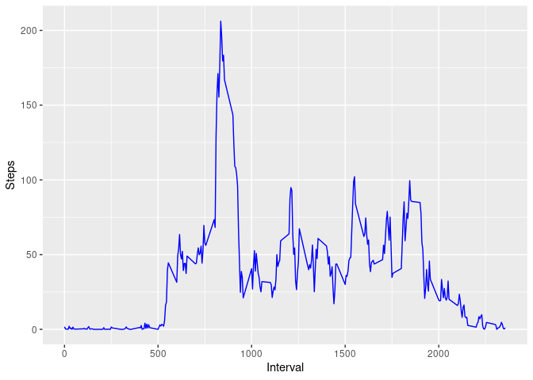
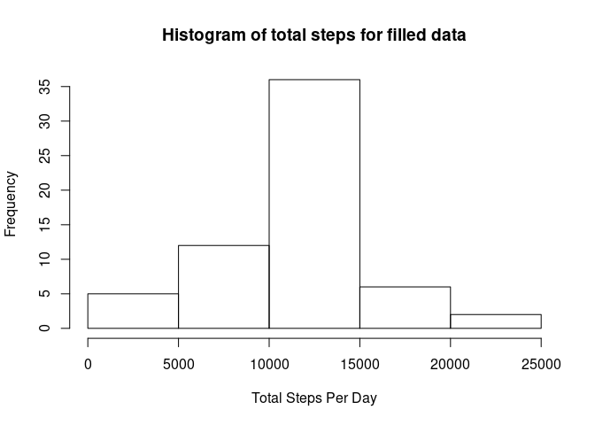
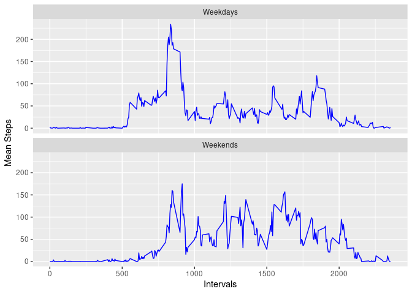

## Loading and preprocessing the data

```r
activity_data <- read.csv("../dataset/activity.csv")
activity_data$date <- as.POSIXct(strptime(activity_data$date,"%Y-%m-%d"))
activity_data$date <- as.Date(activity_data$date)
```


## What is mean total number of steps taken per day?

```r
mean_steps <- mean(activity_data$steps,na.rm = TRUE)
print(mean_steps)
```

```
## [1] 37.3826
```

Mean total number of steps are 37.3825996

## What is the average daily activity pattern?

```r
library(tidyverse)
```

```
## ── Attaching packages ────────────────────────────────────────── tidyverse 1.3.0 ──
```

```
## ✓ ggplot2 3.3.1     ✓ purrr   0.3.4
## ✓ tibble  3.0.1     ✓ dplyr   1.0.0
## ✓ tidyr   1.1.0     ✓ stringr 1.4.0
## ✓ readr   1.3.1     ✓ forcats 0.5.0
```

```
## ── Conflicts ───────────────────────────────────────────── tidyverse_conflicts() ──
## x dplyr::filter() masks stats::filter()
## x dplyr::lag()    masks stats::lag()
```

```r
complete_data <- na.omit(activity_data)
daily_steps <- tapply(complete_data$steps, complete_data$interval, mean)
intervals <- as.integer(names(daily_steps))
step_list <- data.frame("Steps" = daily_steps,"Interval" = intervals) 


steps_plot <- ggplot(step_list,aes(x = Interval,y = Steps)) +
        geom_line(col = "blue") 

print(steps_plot)
```

<!-- -->

```r
Max_steps <- filter(step_list,Steps == max(step_list$Steps))$Interval
```

### Maximum steps
Maximum steps is in the interval value of 835

## Imputing missing values


```r
missing_data <- is.na(activity_data)
sum_na_data <- sum(missing_data)

# Function for completing NA step values from interval means
data_fill <- function(data_set){
        for(i in seq_along(data_set[,1])){
                index = data_set[i,3]
                if(is.na(data_set[i,1])){data_set[i,1] <- mean(subset(data_set,interval==index)$steps,na.rm = TRUE)}
        }
return(data_set)
}

filled_data <- data_fill(activity_data)

hist(filled_data$steps,xlab = "Total Steps", main = "Histogram of Total Steps per Day")
```

<!-- -->

```r
mean_fill <- mean(filled_data$steps)
median_fill <- median(filled_data$steps)
```

### Mean and Median Values for Steps
Mean steps for the completed activity data is 37.3825996.

Median steps for the completed activity data is 0.


## Are there differences in activity patterns between weekdays and weekends?


```r
library(lubridate)
```

```
## 
## Attaching package: 'lubridate'
```

```
## The following objects are masked from 'package:base':
## 
##     date, intersect, setdiff, union
```

```r
activity_data <- mutate(activity_data, Days = wday(date))
activity_data <- mutate(activity_data, Weekend = as.integer(Days > 5))
activity_data$Weekend <- as.factor(activity_data$Weekend)

variable_names <- list("0" = "Weekdays","1" = "Weekends")
variable_labeller <- function(variable,value){
  return(variable_names[value])
}

mean_activity <- activity_data %>%
  group_by(Weekend,interval) %>%
  summarise(
    means_Steps = mean(steps,na.rm = TRUE)
  )
```

```
## `summarise()` regrouping output by 'Weekend' (override with `.groups` argument)
```

```r
ggplot(mean_activity,aes(interval,means_Steps)) +
        geom_line(col= "blue") +
        facet_wrap(~Weekend,nrow = 2,ncol = 1,labeller =   variable_labeller) +
        xlab("Intervals") + 
        ylab("Mean Steps")
```

```
## Warning: The labeller API has been updated. Labellers taking `variable` and
## `value` arguments are now deprecated. See labellers documentation.
```

<!-- -->


