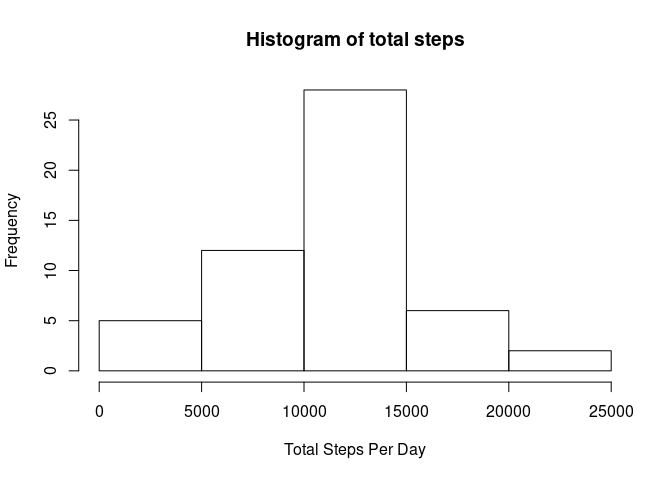

## Loading and preprocessing the data

```r
activity_data <- read.csv("activity.csv")
activity_data$date <- as.POSIXct(strptime(activity_data$date,"%Y-%m-%d"))
activity_data$date <- as.Date(activity_data$date)
library(tidyverse)
```

```
## ── Attaching packages ────────────────────────────────────────── tidyverse 1.3.0 ──
```

```
## ✓ ggplot2 3.3.1     ✓ purrr   0.3.4
## ✓ tibble  3.0.1     ✓ dplyr   1.0.0
## ✓ tidyr   1.1.0     ✓ stringr 1.4.0
## ✓ readr   1.3.1     ✓ forcats 0.5.0
```

```
## ── Conflicts ───────────────────────────────────────────── tidyverse_conflicts() ──
## x dplyr::filter() masks stats::filter()
## x dplyr::lag()    masks stats::lag()
```


## What is mean total number of steps taken per day?

```r
total_steps <- aggregate(activity_data$steps,by = list(Category = activity_data$date),FUN = sum)

hist(total_steps$x,xlab = "Total Steps Per Day", ylab = "Frequency", main = "Histogram of total steps")
```

<!-- -->

```r
print(mean(total_steps$x,na.rm = TRUE))
```

```
## [1] 10766.19
```

```r
print(median(total_steps$x,na.rm = TRUE))
```

```
## [1] 10765
```


## What is the average daily activity pattern?

```r
library(tidyverse)
complete_data <- na.omit(activity_data)
daily_steps <- tapply(complete_data$steps, complete_data$interval, mean)
intervals <- as.integer(names(daily_steps))
step_list <- data.frame("Steps" = daily_steps,"Interval" = intervals) 


steps_plot <- ggplot(step_list,aes(x = Interval,y = Steps)) +
        geom_line(col = "blue") 

print(steps_plot)
```

<!-- -->

```r
Max_steps <- filter(step_list,Steps == max(step_list$Steps))$Interval
```

### Maximum steps
Maximum steps is in the interval value of 835

## Imputing missing values


```r
missing_data <- is.na(activity_data)
sum_na_data <- sum(missing_data)


print(sum_na_data)
```

```
## [1] 2304
```

```r
# Function for replacing NA step values from same interval means, 
data_fill <- function(data_set){
        for(i in seq_along(data_set[,1])){
                index = data_set[i,3]
                if(is.na(data_set[i,1])){data_set[i,1] <- mean(subset(data_set,interval==index)$steps,na.rm = TRUE)}
        }
return(data_set)
}

filled_data <- data_fill(activity_data)

filled_steps <- aggregate(filled_data$steps,by = list(Category = activity_data$date),FUN = sum)

hist(filled_steps$x,xlab = "Total Steps Per Day", ylab = "Frequency", main = "Histogram of total steps for filled data")
```

<!-- -->

```r
print(mean(filled_steps$x,na.rm = TRUE))
```

```
## [1] 10766.19
```

```r
print(median(filled_steps$x,na.rm = TRUE))
```

```
## [1] 10766.19
```

### Mean and Median Values for Steps


```r
#Mean
print(mean(filled_steps$x,na.rm = TRUE))
```

```
## [1] 10766.19
```

```r
#Median
print(median(filled_steps$x,na.rm = TRUE))
```

```
## [1] 10766.19
```

Filling missing data with interval means did not have much effect on the distribution of the data as the mean and median stayed practically the same.


## Are there differences in activity patterns between weekdays and weekends?


```r
library(lubridate)
```

```
## 
## Attaching package: 'lubridate'
```

```
## The following objects are masked from 'package:base':
## 
##     date, intersect, setdiff, union
```

```r
activity_data <- mutate(activity_data, Days = wday(date))
activity_data <- mutate(activity_data, Weekend = as.integer(Days > 5))
activity_data$Weekend <- as.factor(activity_data$Weekend)

variable_names <- list("0" = "Weekdays","1" = "Weekends")
variable_labeller <- function(variable,value){
  return(variable_names[value])
}

mean_activity <- activity_data %>%
  group_by(Weekend,interval) %>%
  summarise(
    means_Steps = mean(steps,na.rm = TRUE)
  )
```

```
## `summarise()` regrouping output by 'Weekend' (override with `.groups` argument)
```

```r
ggplot(mean_activity,aes(interval,means_Steps)) +
        geom_line(col= "blue") +
        facet_wrap(~Weekend,nrow = 2,ncol = 1,labeller =   variable_labeller) +
        xlab("Intervals") + 
        ylab("Mean Steps")
```

```
## Warning: The labeller API has been updated. Labellers taking `variable` and
## `value` arguments are now deprecated. See labellers documentation.
```

<!-- -->

On general looks like weekends has higher activity than weekdays. 

Especially, the plots of weekday and weekend activity hints that at the weekends late day activity is more prominent compared to weekday late day activities. 


